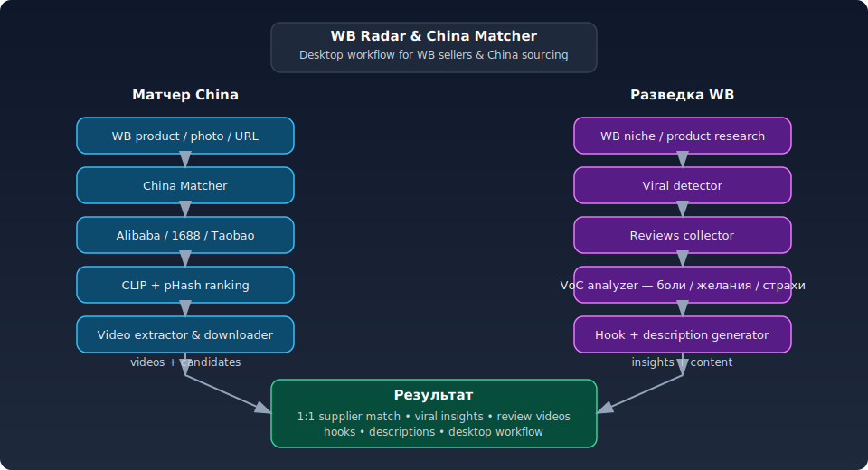
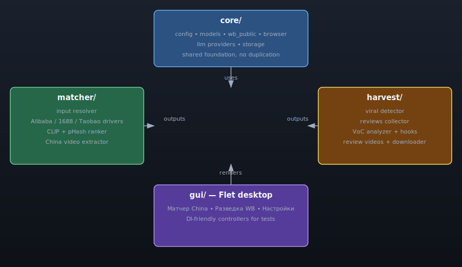
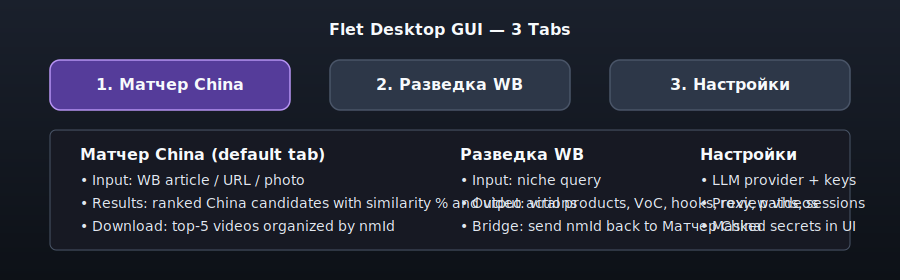

# WB Radar & China Matcher


Desktop-инструмент для поставщиков и селлеров Wildberries: ищите товар 1:1 на китайских площадках и разведывайте вирусные продукты на WB.



> End-to-end workflow: from WB product research to China matching, review mining, hooks and video assets.

> [Клонируйте репозиторий](https://github.com/pavelvladimirovich258614-sys/WB_Radar_China_Matcher.git)

```bash
git clone https://github.com/pavelvladimirovich258614-sys/WB_Radar_China_Matcher.git
cd WB_Radar_China_Matcher
```

## Какие боли закрывает

- Сложно найти 1:1 поставщика товара на China-площадках.
- Сложно понять, почему товар на WB продаётся — отзывы разбросаны.
- Видео из отзывов WB не используется как материал для контента.
- Ручной анализ WB + China занимает часы.
- Нет связки «разведка → матчинг → видео → описание → хуки» в одном инструменте.

## Решение

WB Radar & China Matcher — это десктопное приложение с тремя вкладками:

- **Матчер China** — WB товар/фото → поиск 1:1 на Alibaba, 1688, Taobao → рейтинг похожести (CLIP + pHash) → извлечение полочного видео.
- **Разведка WB** — ниша → вирусные товары → сбор отзывов → VoC-анализ (боли/желания/страхи) → генерация хуков и раскадровки.
- **Настройки** — выбор LLM-провайдера, proxy, папок, статус сессий, сохранение ключей в `.env.local`.

## Архитектура



```text
core/      — конфиг, модели, WB-клиент, браузер, LLM, storage
matcher/   — поиск по фото на China-площадках, ранкер, извлечение видео
harvest/   — разведка WB: вирусные товары, отзывы, VoC, хуки, видео, скачивание
gui/       — Flet-интерфейс, 3 вкладки
tests/     — unit, integration, e2e и live smoke tests
fixtures/  — сохранённые фикстуры ответов
```

Подробнее: [docs/ARCHITECTURE.md](docs/ARCHITECTURE.md).

## Как это работает

### Матчер China


Пользователь вводит артикул WB, ссылку или фото. Приложение нормализует вход в `query.jpg`, выполняет поиск по картинке на Alibaba, 1688 и Taobao, ранжирует кандидатов по визуальной похожести, извлекает видео карточек и позволяет скачать топ-5 видео.

### Разведка WB


Пользователь вводит нишу. Приложение ищет товары на WB, отбирает топ по отзывам, считает viral score по скорости отзывов, собирает отзывы, прогоняет их через LLM для извлечения болей/желаний/страхов, генерирует хуки и позволяет перекинуть `nmId` обратно в Матчер China.

### GUI



## Clone & run

Windows:

```powershell
py -3.11 -m venv .venv
.venv\Scripts\Activate.ps1
python -m pip install -U pip
pip install -r requirements.txt
playwright install chromium
```

Скопируйте `.env.example` в `.env` и заполните ключи:

```env
OPENROUTER_API_KEY=sk-...
ZAI_API_KEY=...
GROQ_API_KEY=...
OLLAMA_BASE_URL=http://localhost:11434
```

Запуск GUI:

```powershell
python run.py
```

## Windows .exe build

```powershell
powershell -ExecutionPolicy Bypass -File scripts\build_windows.ps1
```

Результат:

```text
dist\WB_Radar_China_Matcher\WB_Radar_China_Matcher.exe
```

В `.exe` не включаются секреты и временные данные. Рядом с `.exe` приложение читает `.env` / `.env.local` и создаёт `sessions/` и `output/`.

Локально собранный exe:

- Path: `dist\WB_Radar_China_Matcher\WB_Radar_China_Matcher.exe`
- Size: **57.6 MB**
- SHA256: `EBE3B4D3613E223E773C09C453810136ED254E0A10EB19E1DF416093CF7ED7AC`

> `.exe` не добавляется в git. Для релиза прикрепите его вручную к GitHub Release.

## Testing

Обычные тесты работают без сети, браузера и реального LLM:

```powershell
.venv\Scripts\python.exe -m pytest -m "not live" -q
```

Результат:

```text
620 passed, 1 skipped, 15 deselected
```

## Live tests

Live-тесты помечены `@pytest.mark.live` и требуют флага:

```powershell
$env:WB_RADAR_RUN_LIVE = "1"
.venv\Scripts\python.exe -m pytest -m live -q
```

WB/China могут возвращать 403 или показывать капчу — это известное ограничение, обход защит не производится.

## Security

- API-ключи и сессии хранятся только в `.env` / `.env.local` / `sessions/`.
- `.env`, `.env.local`, `sessions/`, `output/`, `build/`, `dist/`, `*.exe`, `*.db` не коммитятся.
- Live-тесты gated через `WB_RADAR_RUN_LIVE=1`.
- Капчи/антибот/WAF не обходятся.
- Видео отзывов используются как референс/материал, а не перезаливаются 1:1.

Подробнее: [SECURITY.md](SECURITY.md).

## Known limitations

- Сборка `.exe` только под Windows (Linux/Mac — Wine/CrossOver, не покрывается скриптом).
- Первый запуск может потребовать `playwright install chromium`.
- WB/China live endpoints могут давать 403/капчу — защиту не обходить.
- ChatGPT-web провайдер (F09) отложен.

## License

[MIT License](LICENSE) © 2026 Pavel Novopoltsev

## Status

F00–F28 завершены (F09 deferred). FULL-E2E-QA: **PASS**. Готов к ручному использованию и публикации.
